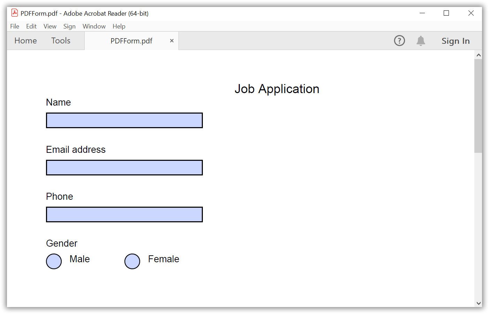
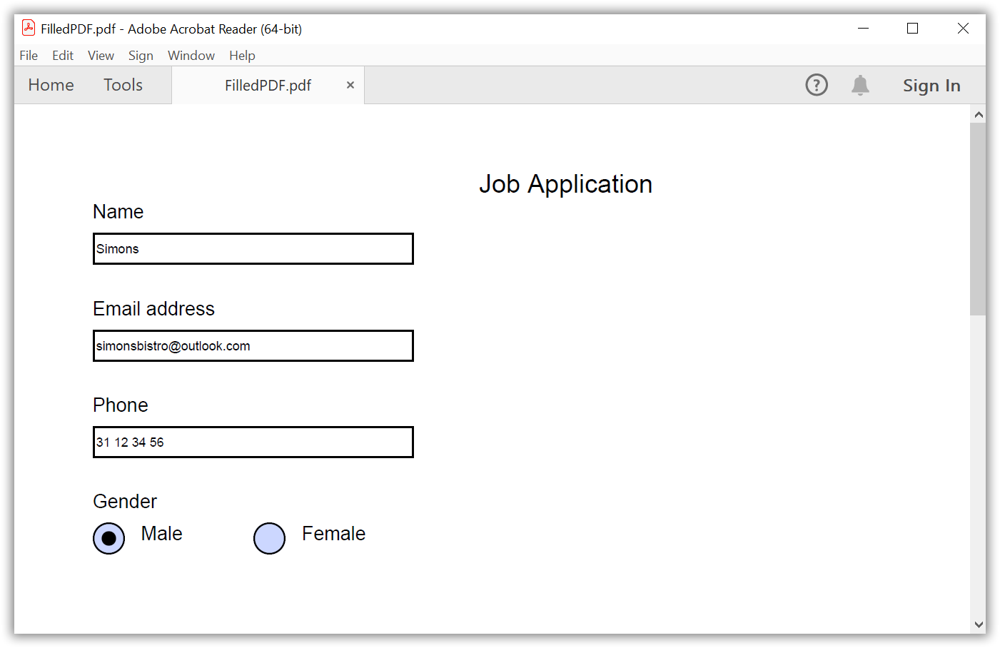
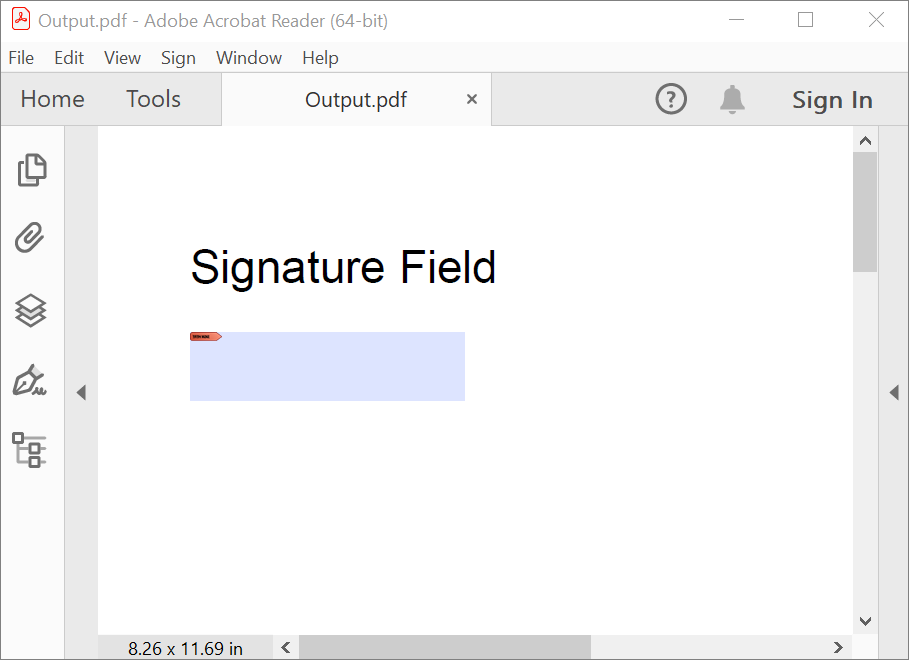
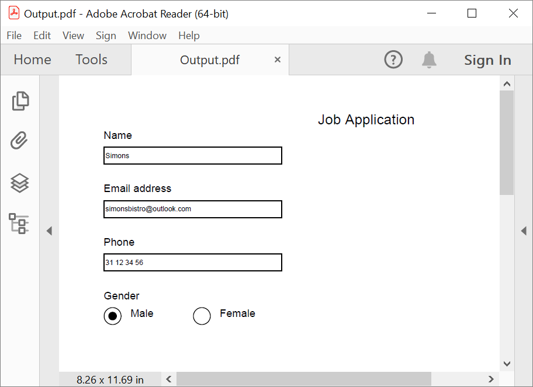
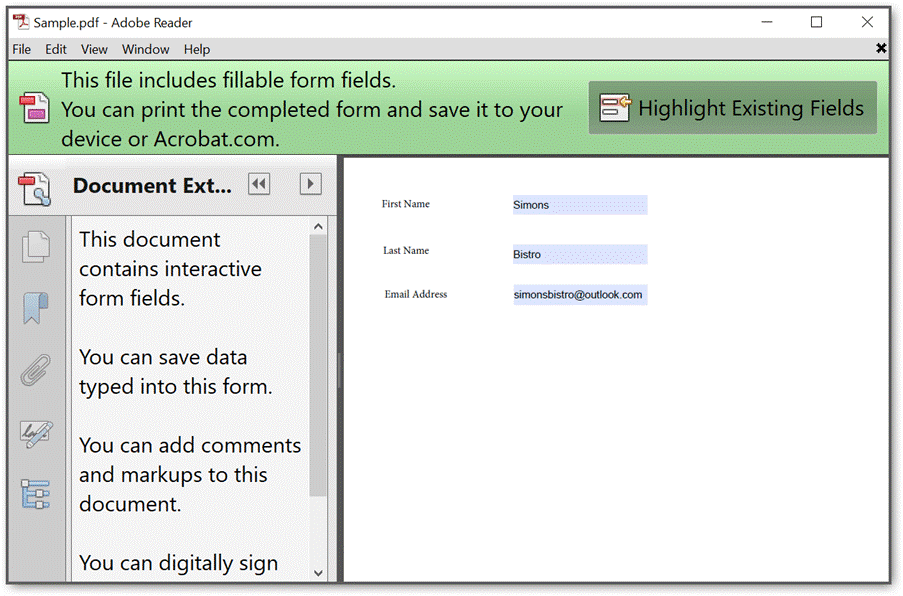
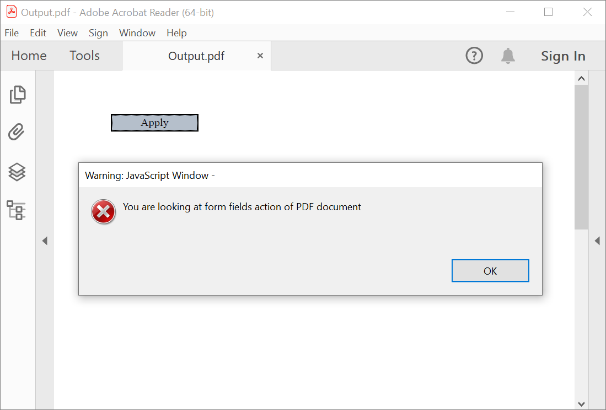

# Create-fill-or-edit-fillable-PDF-forms-csharp

The Syncfusion&reg; .NET PDF library provide comprehensive support for creating, customizing, and managing form fields in the PDF document. 

In this reposiory, we will explore various use cases of PDF forms and how they can be implemented using the Syncfusion&reg; .NET PDF library. Some of the use cases that we will cover in this article include: 

* Create a new fillable PDF form  
* Fill form fields in an existing PDF document  
* Modify the existing form fields in PDF document  
* Removing the form fields from an existing PDF document  
* Creating signature field and signing the PDF document 
* Removing editing capability of form fields 
* Import/Export PDF forms data  
* Retain extended rights of a PDF forms  
* Utilizing JavaScript in PDF forms 

Sample name | Description
--- | ---
[Create PDF form](https://github.com/SyncfusionExamples/Create-fill-or-edit-fillable-PDF-forms-csharp/tree/master/Create_PDF_form_NET) | Create a PDF form with all form fields. 
[Fill form fields in PDF](https://github.com/SyncfusionExamples/Create-fill-or-edit-fillable-PDF-forms-csharp/tree/master/Fill_form_fields_in_PDF_NET) | Fill form fields in an existing PDF document. 
[Modify existing PDF form](https://github.com/SyncfusionExamples/Create-fill-or-edit-fillable-PDF-forms-csharp/tree/master/Modify_form_fields_NET) | Modify the existing form field and its properties like bounds, text, color, border, etc. 
[Removing form fields from an existing PDF](https://github.com/SyncfusionExamples/Create-fill-or-edit-fillable-PDF-forms-csharp/tree/master/Remove_form_fields_from_PDF_NET) | Remove form fields from an existing PDF document. 
[Add signature field to PDF document](https://github.com/SyncfusionExamples/Create-fill-or-edit-fillable-PDF-forms-csharp/tree/master/Create_signature_field_in_PDF) | Create signature field in a new PDF document. 
[Flattening form fields](https://github.com/SyncfusionExamples/Create-fill-or-edit-fillable-PDF-forms-csharp/tree/master/Flatten_form_fields_in_PDF) | Flatten the form fields in an existing PDF document. 
[Set form fields as read only](https://github.com/SyncfusionExamples/Create-fill-or-edit-fillable-PDF-forms-csharp/tree/master/Set_ReadOnly_to_PDF_form_NET) | Marking the PDF form as read-only. 
[Import form fields data to PDF document](https://github.com/SyncfusionExamples/Create-fill-or-edit-fillable-PDF-forms-csharp/tree/master/Import_form_fields_data_to_PDF) | Importing form fields data (FDF, XFDF, JSON and XML) to PDF document. 
[Export PDF file to FDF/XFDF/XML/JSON](https://github.com/SyncfusionExamples/Create-fill-or-edit-fillable-PDF-forms-csharp/tree/master/Export_PDF_file_to_FDF) | Export FDF/XFDF/XML/JSON file from PDF document. 
[Retain extended rights of PDF form](https://github.com/SyncfusionExamples/Create-fill-or-edit-fillable-PDF-forms-csharp/tree/master/Preserve_extended_rights_in_PDF_form) | preserve extended rights when filling the form fields in PDF document. 
[Utilizing JavaScript in PDF forms](https://github.com/SyncfusionExamples/Create-fill-or-edit-fillable-PDF-forms-csharp/tree/master/Adding_action_to_PDF_form_field) | Add JavaScript action to form field in PDF document. 

## Create a new fillable PDF form 
With Syncfusion's .NET PDF library, users can easily create forms (Acroforms) in PDF documents with a variety of form fields. These fields include textbox fields, combo box fields, radio button fields, list box fields, check box fields, signature fields, and button fields. 

```csharp

//Create a new PDF document 
PdfDocument document = new PdfDocument(); 
//Add a new page to the PDF document 
PdfPage page = document.Pages.Add(); 
//Set the standard font 
PdfFont font = new PdfStandardFont(PdfFontFamily.Helvetica, 16); 
//Draw the string       
page.Graphics.DrawString("Job Application", font, PdfBrushes.Black, new PointF(250, 0)); 
font = new PdfStandardFont(PdfFontFamily.Helvetica, 12); 
page.Graphics.DrawString("Name", font, PdfBrushes.Black, new PointF(10, 20)); 

//Create a text box field for name 
PdfTextBoxField textBoxField1 = new PdfTextBoxField(page, "Name"); 
textBoxField1.Bounds = new RectangleF(10, 40, 200, 20); 
textBoxField1.ToolTip = "Name"; 
document.Form.Fields.Add(textBoxField1); 
page.Graphics.DrawString("Email address", font, PdfBrushes.Black, new PointF(10, 80)); 

//Create a text box field for email address 
PdfTextBoxField textBoxField3 = new PdfTextBoxField(page, "Email address"); 
textBoxField3.Bounds = new RectangleF(10, 100, 200, 20); 
textBoxField3.ToolTip = "Email address"; 
document.Form.Fields.Add(textBoxField3); 
page.Graphics.DrawString("Phone", font, PdfBrushes.Black, new PointF(10, 140)); 

//Create a text box field for phone 
PdfTextBoxField textBoxField4 = new PdfTextBoxField(page, "Phone"); 
textBoxField4.Bounds = new RectangleF(10, 160, 200, 20); 
textBoxField4.ToolTip = "Phone"; 
document.Form.Fields.Add(textBoxField4); 
page.Graphics.DrawString("Gender", font, PdfBrushes.Black, new PointF(10, 200)); 

//Create radio button for gender 
PdfRadioButtonListField employeesRadioList = new PdfRadioButtonListField(page, "Gender"); 
document.Form.Fields.Add(employeesRadioList); 
page.Graphics.DrawString("Male", font, PdfBrushes.Black, new PointF(40, 220)); 
PdfRadioButtonListItem radioButtonItem1 = new PdfRadioButtonListItem("Male"); 
radioButtonItem1.Bounds = new RectangleF(10, 220, 20, 20); 
page.Graphics.DrawString("Female", font, PdfBrushes.Black, new PointF(140, 220)); 
PdfRadioButtonListItem radioButtonItem2 = new PdfRadioButtonListItem("Female"); 
radioButtonItem2.Bounds = new RectangleF(110, 220, 20, 20); 
employeesRadioList.Items.Add(radioButtonItem1); 
employeesRadioList.Items.Add(radioButtonItem2); 

//Create file stream. 
using (FileStream outputFileStream = new FileStream("Output.pdf", FileMode.Create, FileAccess.ReadWrite)) 
{ 
    //Save the PDF document to file stream. 
    document.Save(outputFileStream); 
} 
//Close the document. 
document.Close(true); 

```

By executing this code example, you will get a PDF document like the following screenshot.  


## Fill form fields in an existing PDF document  

To retrieve a form field from a pre-existing document using the field name, you may utilize the TryGetField method within the PdfFormFieldCollection class. This method can determine the field's availability within the form by returning a Boolean value. 

The following code example shows how to fill form fields in an existing PDF document.  

```csharp

//Load the PDF document 
PdfLoadedDocument loadedDocument = new PdfLoadedDocument(docStream); 
//Load the form from the loaded document. 
PdfLoadedForm form = loadedDocument.Form; 
//Load the form field collections from the form. 
PdfLoadedFormFieldCollection fieldCollection = form.Fields as PdfLoadedFormFieldCollection; 
PdfLoadedField loadedField = null; 

//Get and fill the field using TryGetField Method. 
if (fieldCollection.TryGetField("Name", out loadedField)) 
{ 
    (loadedField as PdfLoadedTextBoxField).Text = "Simons"; 
} 
if (fieldCollection.TryGetField("Email address", out loadedField)) 
{ 

    (loadedField as PdfLoadedTextBoxField).Text = "simonsbistro@outlook.com"; 
} 
if (fieldCollection.TryGetField("Phone", out loadedField)) 
{ 
    (loadedField as PdfLoadedTextBoxField).Text = "31 12 34 56"; 
} 
if (fieldCollection.TryGetField("Gender", out loadedField)) 
{ 
    (loadedField as PdfLoadedRadioButtonListField).SelectedIndex = 0; 
} 

//Create file stream. 
using(FileStream outputFileStream = new FileStream("Output.pdf", FileMode.Create, FileAccess.ReadWrite)) 
{ 
    //Save the PDF document to file stream. 
    loadedDocument.Save(outputFileStream); 
} 
//Close the document. 
loadedDocument.Close(true); 

```

By executing the code example, you will get a filled PDF document with the values set for the form fields. Here's an example of what the filled PDF document might look like:  


## Modifying the existing form field in PDF document  

You can modify the existing form field and its properties like bounds, text, color, border, etc. The following code example illustrates how to modify the existing form field in a PDF document.  

```csharp

//Load the PDF document.
PdfLoadedDocument loadedDocument = new PdfLoadedDocument(docStream); 
//Get the loaded form. 
PdfLoadedForm loadedForm = loadedDocument.Form; 

//Get the loaded form field and modify the properties. 
PdfLoadedTextBoxField loadedTextBoxField = loadedForm.Fields[0] as PdfLoadedTextBoxField; 
RectangleF newBounds = new RectangleF(200, 80, 300, 30); 
loadedTextBoxField.Bounds = newBounds; 
loadedTextBoxField.SpellCheck = true; 
loadedTextBoxField.Text = "New text of the field."; 
 
//Create file stream. 
using (FileStream outputFileStream = new FileStream("Output.pdf", FileMode.Create, FileAccess.ReadWrite)) 
{ 
    //Save the PDF document to file stream. 
    loadedDocument.Save(outputFileStream); 
} 
//Close the document. 
loadedDocument.Close(true); 

``` 

## Removing the form fields from an existing PDF document  

The Syncfusion&reg; .NET PDF library provides a simple and efficient way to remove form fields from a PDF document. The following code illustrates how to remove form fields from an existing PDF document.

```csharp 

//Load the PDF document. 
PdfLoadedDocument loadedDocument = new PdfLoadedDocument(docStream); 
//Get the loaded form. 
PdfLoadedForm loadedForm = loadedDocument.Form; 

//Load the textbox field. 
PdfLoadedTextBoxField loadedTextBoxField = loadedForm.Fields[0] as PdfLoadedTextBoxField; 
//Remove the field. 
loadedForm.Fields.Remove(loadedTextBoxField); 
//Remove the field at index 0. 
loadedForm.Fields.RemoveAt(0); 

//Create file stream. 
using (FileStream outputFileStream = new FileStream("Output.pdf", FileMode.Create, FileAccess.ReadWrite)) 
{ 
    //Save the PDF document to file stream. 
    loadedDocument.Save(outputFileStream); 
} 
//Close the document. 
loadedDocument.Close(true); 

```

## Creating signature field and signing the PDF document 

Creating signature fields and signing PDF documents is a critical feature in document management. However, with Syncfusion&reg; .NET PDF library, this process can be made much easier.  

### Adding the signature field to the PDF document  

The following code example illustrates how to create signature field in new PDF document.  

```csharp 

//Create a new PDF document. 
PdfDocument document = new PdfDocument(); 
//Add a new page to PDF document. 
PdfPage page = document.Pages.Add(); 

//Create PDF Signature field. 
PdfSignatureField signatureField = new PdfSignatureField(page, "Signature"); 
//Set properties to the signature field. 
signatureField.Bounds = new RectangleF(0, 100, 90, 20); 
signatureField.ToolTip = "Signature"; 
//Add the form field to the document. 
document.Form.Fields.Add(signatureField); 

//Create file stream. 
using (FileStream outputFileStream = new FileStream("Output.pdf", FileMode.Create, FileAccess.ReadWrite)) 
{ 
    //Save the PDF document to file stream. 
    document.Save(outputFileStream); 
} 
//Close the document. 
document.Close(true); 

``` 

By executing this code example, you will get a PDF document like the following screenshot.  


### Digitally sign the PDF document  

To digitally sign and verify signatures in PDF files using C#, you can refer to this blog post for detailed instructions: ["Digitally Sign and Verify Signatures in PDF Files Using C#"](https://www.syncfusion.com/blogs/post/create-validate-pdf-digital-signatures-csharp.aspx).  

## Removing editing capability of form fields 

### Flattening form fields  
Syncfusion&reg; .NET PDF library provides support to Flatten a form field or entire form by removing the existing form field and replacing it with graphical objects that would resemble the form field and cannot be edited.   

The following code example illustrates how to flatten the form fields in an existing PDF document.  

```csharp 

//Load the PDF document. 
PdfLoadedDocument loadedDocument = new PdfLoadedDocument(docStream); 
//Get the loaded form. 
PdfLoadedForm loadedForm = loadedDocument.Form; 
PdfLoadedFormFieldCollection fields = loadedForm.Fields; 
//Flatten the whole form. 
loadedForm.Flatten = true; 

//Create file stream. 
using (FileStream outputFileStream = new FileStream("Output.pdf", FileMode.Create, FileAccess.ReadWrite)) 
{ 
    //Save the PDF document to file stream. 
    loadedDocument.Save(outputFileStream); 
} 
//Close the document. 
loadedDocument.Close(true); 

``` 

### Marking the PDF form as read only 

The following code example illustrates how to set read only to an existing PDF document.  

```csharp 

//Load the PDF document. 
PdfLoadedDocument loadedDocument = new PdfLoadedDocument(docStream); 
//Get the loaded form. 
PdfLoadedForm loadedForm = loadedDocument.Form; 
//Set the form as read only. 
loadedForm.ReadOnly = true; 

//Create file stream. 
using (FileStream outputFileStream = new FileStream("Output.pdf", FileMode.Create, FileAccess.ReadWrite)) 
{ 
    //Save the PDF document to file stream. 
    loadedDocument.Save(outputFileStream); 
} 
//Close the document. 
loadedDocument.Close(true); 

```

By executing this code example, you will get a PDF document like the following screenshot.  


## Import/Export PDF forms data  

The Syncfusion&reg; .NET PDF library supports import and export of PDF form data through various formats such as FDF, XFDF, JSON, and XML. This makes it easy to integrate form data with other applications and systems.  

### Import form fields data to PDF document  
Here's an example code example that demonstrates how to import form fields data to PDF document using ImportDataFDF method. Additionally, Syncfusion&reg; also supports importing form data in XFDF, JSON, and XML formats.  

```csharp 

//Load the PDF document. 
PdfLoadedDocument loadedDocument = new PdfLoadedDocument(docStream); 
//Load the existing form. 
PdfLoadedForm loadedForm = loadedDocument.Form; 
//Load the FDF file. 
FileStream fileStream = new FileStream("Input.fdf", FileMode.Open, FileAccess.Read); 
//Import the FDF stream. 
loadedForm.ImportDataFDF(fileStream, true); 

//Create file stream. 
using (FileStream outputFileStream = new FileStream("Output.pdf", FileMode.Create, FileAccess.ReadWrite)) 
{ 
    //Save the PDF document to file stream. 
    loadedDocument.Save(outputFileStream); 
} 
//Close the document. 
loadedDocument.Close(true); 

```

### Export PDF file to FDF/XFDF/XML/JSON

The below code example illustrates how to export FDF/XFDF/XML/JSON file from PDF document using ExportData method. You can specify the format of export data using DataFormat Enum.  

```csharp 

//Load the PDF document. 
PdfLoadedDocument loadedDocument = new PdfLoadedDocument(docStream); 
//Load an existing form.  
PdfLoadedForm loadedForm = loadedDocument.Form; 
//Create memory stream. 
MemoryStream ms = new MemoryStream(); 
//Load the FDF file.  
FileStream stream = new FileStream("Export.fdf", FileMode.Create, FileAccess.ReadWrite); 
//Export the existing PDF document to FDF file.  
loadedForm.ExportData(stream, DataFormat.Fdf, "AcroForm1"); 
//Close the document. 
loadedDocument.Close(true); 

``` 

## Retain extended rights of a PDF forms  

Extended features in a PDF form refer to additional capabilities that are not part of the standard PDF specification. These features allow users to do more with the form than just filling out fields and submitting data. The Syncfusion&reg; .NET PDF library provides support to preserve extended rights in PDF forms when performing actions like filling out form fields. 

The following code example illustrates how to preserve extended rights when filling the form fields using the Syncfusion&reg; .NET PDF library: 

```csharp 

//Load an existing PDF. 
PdfLoadedDocument loadedDocument = new PdfLoadedDocument(docStream); 
//Load the form from the loaded document. 
PdfLoadedForm loadedForm = loadedDocument.Form; 
loadedForm.SetDefaultAppearance(false);
//Load the form field collections from the form. 
PdfLoadedFormFieldCollection fieldCollection = loadedForm.Fields as PdfLoadedFormFieldCollection; 
PdfLoadedField loadedField = null; 

//Get the field using TryGetField Method. 
if (fieldCollection.TryGetField("First Name", out loadedField)) 
{ 
    (loadedField as PdfLoadedTextBoxField).Text = "Simons"; 
} 
if (fieldCollection.TryGetField("Last Name", out loadedField)) 
{ 
    (loadedField as PdfLoadedTextBoxField).Text = "Bistro"; 
} 
if (fieldCollection.TryGetField("Email Address", out loadedField)) 
{ 
    (loadedField as PdfLoadedTextBoxField).Text = "simonsbistro@outlook.com"; 
} 

//Create file stream. 
using (FileStream outputFileStream = new FileStream("Output.pdf", FileMode.Create, FileAccess.ReadWrite)) 
{ 
    //Save the PDF document to file stream. 
    loadedDocument.Save(outputFileStream); 
} 
//Close the document. 
loadedDocument.Close(true); 

```

By executing this code example, you will get a PDF document like the following screenshot.  


## Utilizing JavaScript in PDF forms 

The Syncfusion&reg; .NET PDF library provides support to add JavaScript action to the form fields using PdfJavaScriptAction class. Follow these steps to add JavaScript action to the form field in PDF document.

The following code example illustrates how to add JavaScript action to PDF form field.  

```csharp 

//Create a new PDF document 
PdfDocument document = new PdfDocument(); 
//Creates a new page 
PdfPage page = document.Pages.Add(); 

//Create a new PdfButtonField 
PdfButtonField submitButton = new PdfButtonField(page, "submitButton"); 
submitButton.Bounds = new RectangleF(25, 160, 100, 20); 
submitButton.Text = "Apply"; 
submitButton.BackColor = new PdfColor(181, 191, 203); 
//Create a new PdfJavaScriptAction. 
PdfJavaScriptAction scriptAction = new PdfJavaScriptAction("app.alert(\"You are looking at form fields action of PDF document\")"); 
//Set the scriptAction to submitButton. 
submitButton.Actions.MouseDown = scriptAction; 
//Add the submit button to the new document 
document.Form.Fields.Add(submitButton); 

//Create file stream. 
using (FileStream outputFileStream = new FileStream("Output.pdf", FileMode.Create, FileAccess.ReadWrite)) 
{ 
    //Save the PDF document to file stream. 
    document.Save(outputFileStream); 
} 
//Close the document. 
document.Close(true); 

```

By executing this code example, you will get a PDF document like the following screenshot.  


# How to run the examples
* Download this project to a location in your disk. 
* Open the solution file using Visual Studio. 
* Rebuild the solution to install the required NuGet package. 
* Run the application.

# Resources
*   **Product page:** [Syncfusion&reg; PDF Framework](https://www.syncfusion.com/document-processing/pdf-framework/net)
*   **Documentation page:** [Syncfusion&reg; .NET PDF library](https://help.syncfusion.com/file-formats/pdf/overview)
*   **Online demo:** [Syncfusion&reg; .NET PDF library - Online demos](https://ej2.syncfusion.com/aspnetcore/PDF/CompressExistingPDF#/bootstrap5)
*   **Blog:** [Syncfusion&reg; .NET PDF library - Blog](https://www.syncfusion.com/blogs/category/pdf)
*   **Knowledge Base:** [Syncfusion&reg; .NET PDF library - Knowledge Base](https://www.syncfusion.com/kb/windowsforms/pdf)
*   **EBooks:** [Syncfusion&reg; .NET PDF library - EBooks](https://www.syncfusion.com/succinctly-free-ebooks)
*   **FAQ:** [Syncfusion&reg; .NET PDF library - FAQ](https://www.syncfusion.com/faq/)

# Support and feedback
*   For any other queries, reach our [Syncfusion&reg; support team](https://www.syncfusion.com/support/directtrac/incidents/newincident?utm_source=github&utm_medium=listing&utm_campaign=github-docio-examples) or post the queries through the [community forums](https://www.syncfusion.com/forums?utm_source=github&utm_medium=listing&utm_campaign=github-docio-examples).
*   Request new feature through [Syncfusion&reg; feedback portal](https://www.syncfusion.com/feedback?utm_source=github&utm_medium=listing&utm_campaign=github-docio-examples).

# License
This is a commercial product and requires a paid license for possession or use. Syncfusion’s licensed software, including this component, is subject to the terms and conditions of [Syncfusion's EULA](https://www.syncfusion.com/eula/es/?utm_source=github&utm_medium=listing&utm_campaign=github-docio-examples). You can purchase a licnense [here](https://www.syncfusion.com/sales/products?utm_source=github&utm_medium=listing&utm_campaign=github-docio-examples) or start a free 30-day trial [here](https://www.syncfusion.com/account/manage-trials/start-trials?utm_source=github&utm_medium=listing&utm_campaign=github-docio-examples).

# About Syncfusion
Founded in 2001 and headquartered in Research Triangle Park, N.C., Syncfusion&reg; has more than 26,000+ customers and more than 1 million users, including large financial institutions, Fortune 500 companies, and global IT consultancies.

Today, we provide 1600+ components and frameworks for web ([Blazor](https://www.syncfusion.com/blazor-components?utm_source=github&utm_medium=listing&utm_campaign=github-docio-examples), [ASP.NET Core](https://www.syncfusion.com/aspnet-core-ui-controls?utm_source=github&utm_medium=listing&utm_campaign=github-docio-examples), [ASP.NET MVC](https://www.syncfusion.com/aspnet-mvc-ui-controls?utm_source=github&utm_medium=listing&utm_campaign=github-docio-examples), [ASP.NET WebForms](https://www.syncfusion.com/jquery/aspnet-webforms-ui-controls?utm_source=github&utm_medium=listing&utm_campaign=github-docio-examples), [JavaScript](https://www.syncfusion.com/javascript-ui-controls?utm_source=github&utm_medium=listing&utm_campaign=github-docio-examples), [Angular](https://www.syncfusion.com/angular-ui-components?utm_source=github&utm_medium=listing&utm_campaign=github-docio-examples), [React](https://www.syncfusion.com/react-ui-components?utm_source=github&utm_medium=listing&utm_campaign=github-docio-examples), [Vue](https://www.syncfusion.com/vue-ui-components?utm_source=github&utm_medium=listing&utm_campaign=github-docio-examples), and [Flutter](https://www.syncfusion.com/flutter-widgets?utm_source=github&utm_medium=listing&utm_campaign=github-docio-examples)), mobile ([Xamarin](https://www.syncfusion.com/xamarin-ui-controls?utm_source=github&utm_medium=listing&utm_campaign=github-docio-examples), [Flutter](https://www.syncfusion.com/flutter-widgets?utm_source=github&utm_medium=listing&utm_campaign=github-docio-examples), [UWP](https://www.syncfusion.com/uwp-ui-controls?utm_source=github&utm_medium=listing&utm_campaign=github-docio-examples), and [JavaScript](https://www.syncfusion.com/javascript-ui-controls?utm_source=github&utm_medium=listing&utm_campaign=github-docio-examples)), and desktop development ([WinForms](https://www.syncfusion.com/winforms-ui-controls?utm_source=github&utm_medium=listing&utm_campaign=github-docio-examples), [WPF](https://www.syncfusion.com/wpf-ui-controls?utm_source=github&utm_medium=listing&utm_campaign=github-docio-examples), [WinUI(Preview)](https://www.syncfusion.com/winui-controls?utm_source=github&utm_medium=listing&utm_campaign=github-docio-examples), [Flutter](https://www.syncfusion.com/flutter-widgets?utm_source=github&utm_medium=listing&utm_campaign=github-docio-examples) and [UWP](https://www.syncfusion.com/uwp-ui-controls?utm_source=github&utm_medium=listing&utm_campaign=github-docio-examples)). We provide ready-to-deploy enterprise software for dashboards, reports, data integration, and big data processing. Many customers have saved millions in licensing fees by deploying our software.
